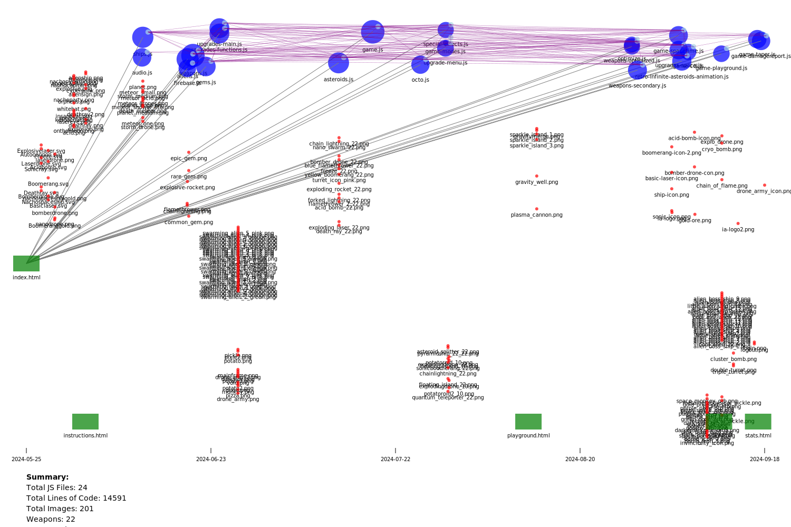

# Description

> This fork has experimental Raspberry Pi arcade support: plug in any USB gamepad and launch in Chromium kiosk mode – see below.

Roguelike verision of asteroids with 22 weapon types and passives unlocked via 40+ achievements. Implemented in vanilla javascript with a firebase backend and customizations for crazygames.


# Project Analysis Visualization



This SVG visualization represents the structure and timeline of the project files.

- Blue circles represent JavaScript files, with size indicating file complexity.
- Image thumbnails are shown at the bottom, aligned with their creation dates.
- Green rectangles represent HTML files.
- Purple lines show connections between related JavaScript files.
- Green lines show connections from HTML to JavaScript files.

The time axis at the bottom shows the project timeline.

# Tasks over time completion (via idl) 


# Infinite Asteroids Game Lifecycle


## 1. Game Login

- `handleUserLogin(id, username)`
  - `loadUserData(userId)`
    - `populateAchievements()`
    - `populateSelectors()`
    - `populateUserScores(last10Scores)`
  - `handleSelections()`

## 2. Game Start

- `initializeGame(mode, replay = false)`
  - `handleSelections()`
  - `multiplierCalculator(mode)`
  - `startGame()`
    - `initializeLastDamageReport()`
    - `createAsteroids()`
    - `resetShip()`
    - `clearInterval(gameLoop)`
    - `gameLoop = setInterval(update, 1000 / 60)`
      - `update()`
        - `calculateAndAdjustFPS()`
        - `drawBackground()`
        - `updateShip()`
        - `checkFloatingIslandSpawn()`
        - `updateFloatingIsland()`
        - `checkIslandCollision()`
        - `updateMegaUpgrades()`
        - `drawFloatingIsland()`
        - `drawActiveMegaUpgrades()`
        - `drawRareAsteroidIndicators()`
        - `drawMegaExplosions()`
        - `updateGems()`
        - `drawGems()`
        - `updateSonicBlast()`
        - `drawSonicBlast()`
        - `updateDeathRay()`
        - `updateExplosiveRockets()`
        - `drawExplosiveRockets()`
        - `updateAcidBombs()`
        - `updateAcidAreas()`
        - `drawAcidBombs()`
        - `drawAcidAreas()`
        - `updateFreezeEffect()`
        - `updateFlamethrower()`
        - `updateAsteroidFire()`
        - `drawActiveWeaponClasses()`
        - `updateBoomerang()`
        - `drawBoomerang()`
        - `updateLasers()`
        - `drawLasers()`
        - `updatenanoswarms()`
        - `drawnanoswarms()`
        - `updateTurret()`
        - `updateTurretLasers()`
        - `drawTurretLasers()`
        - `drawTurret()`
        - `updateBomberDrones()`
        - `drawBomberDrones()`
        - `updateDrones()`
        - `drawDrones()`
        - `updateAsteroids()`
        - `drawAsteroids()`
        - `checkLaserCollisions()`
        - `updateExplosions()`
        - `drawExplosions()`
        - `updateAliens()`
        - `updateAlienLasers()`
        - `drawAliens()`
        - `updateBossAlien()`
        - `drawBossAlien()`
        - `updateBossAlienLaser()`
        - `drawBossAlienLaser()`
        - `updateSuperBossAlien()`
        - `drawSuperBossAlien()`
        - `updateMegaBossAlien()`
        - `drawMegaBossAlien()`
        - `updateOctoBoss()`
        - `drawOctoBoss()`
        - `updateAndDrawParticles()`
        - `updateAndDrawShockwaves()`
        - `drawAlienLasers()`
        - `spawnAliens(wave)`
        - `checkForUpgradeSpawn()`
        - `recordWeaponDamageForWave()`
        - `updateParticles()`
        - `drawParticles()`
        - `drawLives()`
        - `drawScore()`
        - `updateAndDrawFloatingUpgrades()`
        - `checkGemCollection()`
        - `drawShip()`

## 3. Game End

- `endGame()`
  - `clearInterval(gameLoop)`
  - `resetShip()`
  - `updateAchievementsAtEnd()`
    - `addAchievement()` (for each relevant achievement)
  - `saveUserScore(userId, gameData)`
  - `loadLeaderboard(gameId, currentMode)`
  - `displayEndGameScreen(topWeapons, newlyUnlockedAchievements, newlyUnlockedWeapons)`
    - `calculateWeaponDPM()`
    - `displayAchievementsSequentially()`
  - `populateSelectors()`
  - `loadLeaderboard(gameId, currentMode)`

  # Statistics

  stats.html


  # Raspberry Pi / Kiosk Mode

1. Install Raspberry Pi OS (Desktop or Lite + `xinit`).
2. Enable GL (FKMS) driver in `raspi-config` for hardware-accelerated canvas.
3. Autostart Chromium in kiosk mode:

```bash
chromium-browser --kiosk --app=file:///home/pi/infiniteasteroids/index.html --disable-pinch --disable-translate --disable-features=OverlayScrollbar
```

4. Connect a USB/Bluetooth gamepad – the game detects it automatically via the Gamepad API.
5. Optionally lower resolution to 1280×720 and set `LOW_SPEC=true` in `settings.js` (not yet committed) for smoother 60 FPS.

---

# Playground

  playground.html

---

## Game Modes & Difficulty Differences

Infinite Asteroids ships with a wide range of “level packs” (internally *Game Modes*).  Each pack tweaks core parameters such as asteroid speed, gravity, meteor frequency, XP curve, and score multipliers.  The table below lists what makes them special.  Values come from `js/game-taper.js > multiplierCalculator()`.

| Pack | Sub-Modes | Key Tweaks |
|------|-----------|------------|
| **Deep Space** | Easy / Normal / Hard / Hero | Classic zero-gravity arena.  Difficulty scales via `asteroidDifficultySpeedMultiplier` (0.7 → 1.3) and shorter *invincibility* windows.  No environmental gimmicks. |
| **Meteor Shower** | Easy / Normal / Hard / Hero | `meteorMode = true` <br>More meteors (`meteorBooster` 7→21) rain constantly.  Asteroid speed starts high (1.6→2.2).  Score multipliers 1.2→8.2 reward the extra chaos. |
| **Planet** | Easy / Normal / Hard / Hero | `planetMode = true` enables curved-surface gravity.  `gravityStrength` rises 60→140 pulling debris toward the planet rim.  Moderate meteor frequency (booster 7→25). |
| **Nebula Run** | Easy / Normal / Hard / Hero | Dense nebula slows lasers and obscures view (visual FX planned).  Lower base speed (1.2→1.8) but high score multipliers 1.8→6.8. |
| **Meta Invaders** | Easy / Normal / Hard / Hero | Alien-heavy variant – spawns extra invader waves, boosted score 2.0→? .  Similar speed curve (1.3→1.9). |
| **Endless Slow** | — | Relaxed zen mode.  Asteroids drift slowly; scoring toned down.  Great for practice. |
| **Co-op** | — | Two-player shared-screen; lives are pooled. |

*(A planned “Curved-surface level” will slot into the Planet pack when implemented.)*
